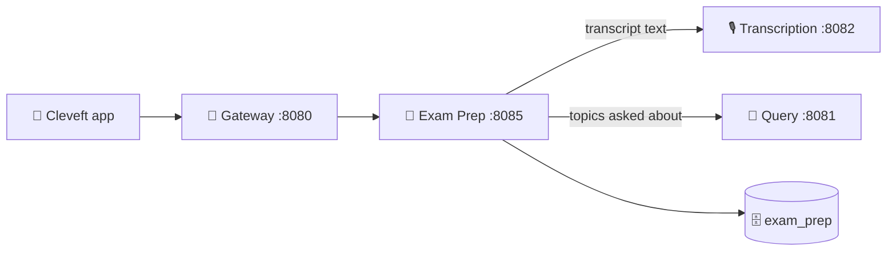

<div align="center">

# 📝 Cleveft Exam Prep Service

**Quiz generation, performance tracking and exam-readiness scoring.**

Turns a transcribed lecture into practice material — then uses how the student
performs on it to work out what they still need to revise.

<br/>


</div>

---

## 🧭 Where this sits

All client traffic arrives through the gateway on `8080`. This service holds no
lecture content of its own — it reads what it needs over HTTP so the
`transcription` schema stays owned by exactly one service.



---

## ✨ What it does

| | |
| :-- | :-- |
| 🧩 **Quiz generation** | Multiple-choice quizzes from lecture content — per lecture, or across a whole course |
| 📊 **Attempt scoring** | Scores each attempt and keeps the history, so mastery can be tracked over time |
| 📄 **Exam summaries** | Condenses a lecture into what is most likely to be examined |
| 🎯 **Readiness scoring** | A readiness figure per course and per lecture |
| 🔍 **Weak areas** | Two independent signals — topics answered badly, and topics the student keeps asking the chatbot about |

---

## 🔌 API

> Base path `/api/v1/examprep` · all routes require a bearer token

### Quizzes

| Method | Path | Description |
| :--- | :--- | :--- |
| `POST` | `/quizzes` | Generate a quiz for a lecture or course |
| `GET` | `/quizzes` | List the student's quizzes |
| `GET` | `/quizzes/{quizId}` | Fetch a quiz with its questions |
| `DELETE` | `/quizzes/{quizId}` | Delete a quiz |

### Attempts

| Method | Path | Description |
| :--- | :--- | :--- |
| `POST` | `/quizzes/{quizId}/attempts` | Submit answers and receive a score |
| `GET` | `/attempts` | Attempt history — powers streaks and trend charts |

### Readiness

| Method | Path | Description |
| :--- | :--- | :--- |
| `GET` | `/readiness` | Readiness across every course |
| `GET` | `/readiness/topics/{topic}/answers` | Every answer you have given on one topic |
| `GET` | `/readiness/lectures/{lectureId}` | Readiness for a single lecture |
| `GET` | `/summaries/{lectureId}` | Exam-focused summary of a lecture |

### 🔧 Internal — service-to-service only

Outside `/api/v1/examprep`, and deliberately not routed by the gateway.

| Method | Path | Description |
| :--- | :--- | :--- |
| `GET` | `/internal/activity/quizzes` | Per-user quiz counts, for the circle board |
| `DELETE` | `/internal/users/{userId}` | Erase quizzes, questions and attempts on account deletion |

---

## ⚙️ Configuration

<details>
<summary><b>Environment variables</b></summary>

<br/>

| Variable | Default | Purpose |
| :--- | :--- | :--- |
| `TRANSCRIPTION_SERVICE_URL` | `http://localhost:8082` | Fetches transcript text to build questions from |
| `QUERY_SERVICE_URL` | `http://localhost:8081` | Reads query-frequency insights for the weak-area signal |
| `GOOGLE_API_KEY` | — | Gemini credentials |
| `GEMINI_MODEL` | `gemini-3.5-flash` | Overridden to `flash-lite` in compose to spread quota |
| `DB_HOST` / `DB_PORT` | `localhost` / `5433` | PostgreSQL |
| `DB_NAME` | `cleveft` | Database name |
| `DB_USERNAME` / `DB_PASSWORD` | `cleveft_user` / `cleveft_pass` | Credentials |

</details>

> [!WARNING]
> Leaving `QUERY_SERVICE_URL` unset does not fail loudly. The readiness page
> simply loses the "topics you keep asking about" half of its weak-area signal,
> and nothing in the logs says so.

---

## 🚀 Running it

**With the full stack**

```bash
cd ../cleveft-infra
docker compose --profile services up -d --build
```

**On its own, against the shared database**

```bash
cd ../cleveft-infra && docker compose up -d   # postgres only
cd ../cleveft-examprep-service && mvn spring-boot:run
```

> [!NOTE]
> Requires Java 21 and a PostgreSQL instance carrying the `exam_prep` schema
> from [`cleveft-infra/init.sql`](https://github.com/Cleveft-Project/cleveft-infra).
> Hibernate runs with `ddl-auto: none`, so this service never creates or alters
> a table.

---

<div align="center">
<sub>Part of the <a href="https://github.com/Cleveft-Project">Cleveft</a> platform</sub>
</div>
